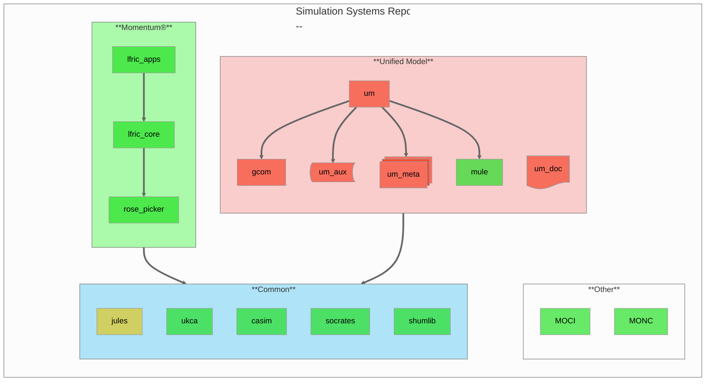

# Simulation Systems

This repository contains documentation that is common across the many simulation
and modelling codes owned by the Met Office.



Expected visibility by late 2025 - early 2026:
$$\textsf{\color{#1de01d}public (Open Source) \space \color{#f7351b}private (Closed Source) \space \color{#cfcf62}public (TBC)}$$

<!-- <code style="background:#1de01da9">public (Open Source)</code> <code style="background:#f7351b9f">private (Closed Source)</code> <code style="background:#cfcf62ff">public (TBC)</code> -->

## Building the documentation

A quick and clean way to get the package dependencies is via
[uv](https://docs.astral.sh/uv/) package manager.

```sh
git clone https://github.com/MetOffice/simulation-systems
cd simulation-systems

# Install dependencies (see pyproject.toml) in project .venv
uv sync
uv run make clean html

# Verify documentation
firefox build/html/index.html
```

Alternatively, if your have Python-3.11 or higher installed (sphinx==8.2.3
requirement), you can install the dependencies in a virtual environment via
`pip`, and build the documentation like:

```sh
cd simulation-systems

</path/to/python3.11+> -m venv .venv
source .venv/bin/activate
pip install .
make clean html
```

## Contributing to the documentation

The documentation is written in sphinx markup. To develop changes to this
documentation first create an issue detailing the changes that are required.
Then create a branch in a clone of this repository, linking it to your issue and
regularly building your changes as described above.

Once happy with your development create a pull request and request a review from
[MetOffice/ssdteam](https://github.com/orgs/MetOffice/teams/ssdteam).
