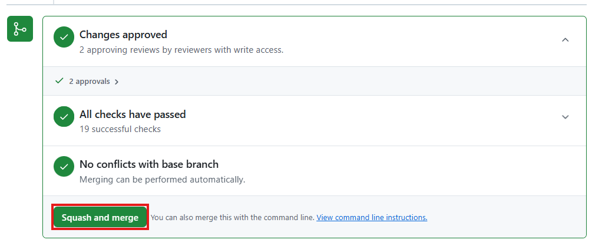
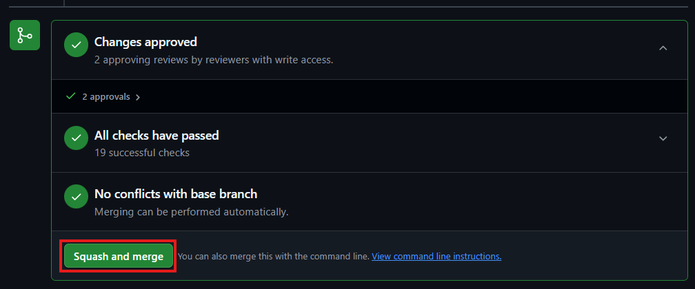

.. _howtocommit:

Merge, Test & Commit
====================

The process for committing a ticket follows this sequence with details for each
of these steps outlined below.

.. important::
    Before You Start:
        * Is anyone else committing?

            * `Main Status`_ is used to coordinate trunk commits all projects.
            * Simple, not conflicting commits can be done in parallel if
              reviewers all agree.
            * Changes with KGO or Macros usually require sole access to the
              trunk.
        * Check how many commits have happened today. Suggested limit per day,
          per repository is 4.

            * More than 4 can be committed if ``all`` groups have been run by a
              team member.

.. important::
    **Linked Tickets?**

    If this is a set of linked tickets then the commit process will need to be
    followed for each repository in parallel.
    See :ref:`committinglinkedtickets` for more details of how this works.

    .. toctree::
        :hidden:

        committinglinkedtickets
        nightlytesting

.. important::

    All changes made by the reviewer (e.g. for upgrade macros, KGOs or linked
    tickets) will be committed to the developers branch in their fork. All
    testing should be run on this branch too. Once this is all complete then
    GitHub can complete the merge of this branch to ``main``.

1. Clone Branch
---------------

.. note::

    If this is a linked ticket, then do these steps for all pull requests

Ensure that the source branch is :ref:`up to date with main <updating_branch>`.
Only resolve conflicts that appear simple and you are comfortable with. If
there are more complicated conflicts ask the developer to solve them
themselves. If there are conflicts in versions.py then see the details in the
macro section below.

Then switch to the up to date branch, e.g.

.. code-block:: shell

    gh repo clone <developer>/<fork_name> <clone_name> -- -b <branch_name>

2. Macros (if required)
-----------------------

**If** the ticket includes metadata changes, upgrade macro changes or a new
rose-stem app then you will need to upgrade the test-suite.

.. dropdown:: versions.py

    ``versions.py`` contains a sequence of upgrade macros. Each macro contains
    a ``BEFORE_TAG`` and an ``AFTER_TAG`` which should create a single chain,
    starting at the last release and finishing with the ticket you are
    committing. The tags have the format version_ticket, i.e.
    ``vnXX.Y_tZZZZ``.

    When resolving conflicts in this file make sure that the new macro being
    added by your ticket is added to the end of the file. Modify the
    ``BEFORE_TAG`` to match the ``AFTER_TAG`` of the previous macro in the
    chain.

    If this is the first macro since the release then the ``BEFORE_TAG`` will
    be the version number with no added ticket number.

    Remove the template macro if it is still present.

.. dropdown:: Applying Macros

    To update the test suite for an upgrade macro, please run:

    .. tab-set::

        .. tab-item:: UM

            .. code-block:: shell

                ./admin/rose-stem/update_all.py \
                    --path=/path/to/working/copy/of/trunk \
                    --um=vnXX.Y_tZZZZ \
                    [--jules-path=/path/to/working/copy/of/jules/trunk]

            where ``-\-um=vnXX.Y_tZZZZ`` is the ``AFTER_TAG`` of the latest
            upgrade macro.

            If there is a macro for fcm_make or createbc then check that the
            makes ``version*_*.py`` has the correct BEFORE and AFTER tags and
            append ``-\-makeum=vnXX.Y_tZZZZ`` and/or
            ``-\-createbc=vnXX.Y_tZZZZ`` to the above command.

            .. warning::

                Please ensure that Cylc7 is used with ``update_all.py`` @vn13.5.

            .. note::

                The ``-\-jules-path`` option is only required if there are
                linked `jules-shared
                <https://code.metoffice.gov.uk/trac/jules/browser/main/trunk/rose-meta/jules-shared>`__
                metadata changes.

        .. tab-item:: JULES

            .. code-block:: shell

                ./bin/upgrade_jules_test_apps vnX.Y_tZZZZ

            where ``vnX.Y_tZZZZ`` is the ``AFTER_TAG`` of the latest upgrade
            macro. The upgrade is expected to fail for the ``fab_jules``,
            ``metadata_checker`` and ``umdp3_checker`` apps.

        .. tab-item:: LFRic Apps + Core

            .. code-block:: shell

                apply_macros.py vnX.Y_tZZZZ [--apps=/path/to/apps] \
                    [--core=/path/to/core] [--jules=/path/to/jules]

            where ``vnX.Y_tZZZZ`` is the ``AFTER_TAG`` of the latest upgrade
            macro and the others are paths to the relevant sources. Apps
            defaults to the current location. Core and Jules default to
            reading the ``dependencies.sh`` file in the Apps source. A copy of
            ``apply_macros.py`` is available at
            ``$UMDIR/SimSys_Scripts/lfric_macros``.

            .. tip::

                ``module load scitools`` will give all required dependencies
                for Met Office users.

            .. note::

                All LFRic Core tickets with macros are expected to be linked
                with LFRic Apps, though they may not have required an LFRic
                Apps development branch (although an Apps ticket should be
                provided). This is fine - if there is no LFRic Apps branch
                just checkout the LFRic Apps main. Then run the apply_macros
                script as described above and this will share the upgrade
                macro across both LFRic Apps and LFRic Core as needed.

    .. important::

        Now commit the changes made by the macros script back to the developers
        branch.

        Do not push the changes at this stage.

.. dropdown:: New rose-stem app?

    If the ticket introduces a new rose-stem app, but doesn't otherwise have a
    macro then that app will need to be updated to match the metadata at the
    Head Of Trunk.

    #. In the new app directory get a list of all available upgrade points by
       running

        .. code-block:: shell

            rose app-upgrade -a -y -M path/to/working_copy/rose-meta

    #. Select the latest upgrade point from the list provided and then run the
       command again, adding this to the end

        .. code-block:: shell

            rose app-upgrade -a -y -M path/to/working_copy/rose-meta vnX.Y_tZZZZ

    The app should now be updated to the same metadata version as the rest of
    the apps on the Trunk. This can be checked with:

        .. code-block:: shell

            rose macro --validate -M path/to/working_copy/rose-meta

    .. note::

        LFRic Apps tickets will require an LFRic Core source to use. You can do
        this by checking out an appropriate working copy, and exporting the
        environment variable ``ROSE_META_PATH=/path/to/core``.

        For UM tickets, if there are linked `jules-shared
        <https://code.metoffice.gov.uk/trac/jules/browser/main/trunk/rose-meta/jules-shared>`__
        metadata changes then a suitable Jules source will need to be included
        in the `ROSE_META_PATH` as described above.

.. dropdown:: Temporary Logical?

    If a new temporary logical has been added, or an old one retired, then
    update the `table that lists them
    <https://code.metoffice.gov.uk/trac/um/wiki/TempUMlogicals>`__.

3. Test (if no KGO)
--------------------

The amount of testing to be done at this stage depends on the complexity of the
ticket, and what has already been done. A minimum level is required for even
trivial tickets to check that the merge has not caused issues, or that there
are no clashes with what else has gone on trunk.

.. note::

    Linked tickets will need to be tested together as discussed on
    the :ref:`Committing Linked Tickets page<testinglinked>`.

.. admonition:: todo

    Update commands to launch rose-stem suite

.. tab-set::

    .. tab-item:: UM

        Run any necessary testing; at the very least run a compile group,
        generally run developer, and more complex tickets warrant running
        everything:

        .. code-block:: shell

            rose stem --group=debug_compile
            OR rose stem --group=developer,ex1a_developer
            OR rose stem --group=all,ex1a

        If there is a change to the build configs then you may need to turn off
        prebuilds. To do so update ``rose-stem/site/meto/variables.rc`` such
        that

        .. code-block:: jinja

            

    .. tab-item:: JULES

        The JULES test suite is quick to run, so it's usual to test ``all`` for
        any ticket. If you have the appropriate environment setup then include
        the ``fab`` group too.

        .. code-block:: shell

            rose stem --group=all,fab

    .. tab-item:: UKCA

        The UKCA rose-stem contains minimal tests at the moment, but should be
        run to confirm the style checker passes.

        .. code-block:: shell

            rose stem --group=all

        UKCA testing should also be carried out using the UM rose stem. Check
        out the UM trunk, and then run

        .. code-block:: shell

            rose stem --group=developer,ukca --source=. \
                --source=/path/to/UKCA/working/copy

    .. tab-item:: LFRic Apps

        LFRic Apps rose-stem contains tests spanning all the applications
        included in the repository. At the very least run the developer group
        which gives a basic level of tests spanning everything. The full set
        of tests may be warranted for any application that has had more
        complex changes.

        .. code-block:: shell

            rose stem --group=developer
            OR e.g. rose stem --group=developer,gungho_model

            cylc play <working copy name>

    .. tab-item:: LFRic Core

        Run the test suite command from the top level of the repository to run
        a complete set of the rose-stem developer suites.

        .. code-block:: shell

            rose stem --group=developer
            cylc play <working copy name>

    .. tab-item:: UM docs

        Check the documentation builds correctly:

        .. code-block:: shell

            module load latex
            ./build_umdoc.py [XXX YYY etc]

        where XXX YYY are the details of which docs require building.

    .. tab-item:: JULES docs

        JULES documentation is hosted within the `JULES GitHub repository
        <https://github.com/jules-lsm/jules-lsm.github.io>`__. To review and
        build the documentation branch locally, move to your local clone of
        the JULES GitHub, then:

        .. code-block:: shell

            git pull
            git switch <branch name>
            cd <path_to>/user_guide/doc
            conda activate jules-user-guide
            make html
            firefox build/html/index.html

        To build and check the LaTeX PDF:

        .. code-block:: shell

            make latexpdf
            evince build/latex/JULES_User_Guide.pdf

4. KGO & Supporting Data (if required)
--------------------------------------

**If** your change is known to alter answers, you need to update rose-stem KGO
for all affected tests before you commit to the trunk.

Supporting data is stored in the filesystems of our machines and changes to use
will require the reviewer to update those files (BIG DATA).

*NB: These instructions are Met Office specific, other sites may manage their
KGO differently*

.. dropdown:: Setup for first KGO install (UM + LFRic Inputs)

    If doing a UM or LFRic Inputs KGO, before you start the process below there
    is a one-time setup step required to allow you to generate KGO using the
    update script.

    Edit ``~/.metomi/rose.conf`` on *all platforms* - Desktop, XCE/F, XCS and
    EXZ to contain the following:

    .. code-block::

        [rose-ana]
        kgo-database=.true.

.. admonition:: todo

    Update commands to launch rose-stem suite

.. _kgo_instructions:

.. tab-set::

    .. tab-item:: UM + LFRic Inputs

        KGO files are stored in ``$UMDIR/standard_jobs/kgo`` or
        ``$UMDIR/standard_jobs/lfricinputs/kgo`` and are installed there using
        a script.

        #. Run the rose stem tasks that require a KGO update, plus any other
           testing required (see above) - if unsure run the `all,ex1a`.

        .. code-block:: shell

            rose stem --group=all,ex1a --new

        #. You will need access to both your merged working copy and a clone of
           the `SimSys_Scripts github repo
           <https://github.com/MetOffice/SimSys_Scripts>`__ (one is available
           in $UMDIR). Run the script ``kgo_updates/meto_update_kgo.sh`` which
           is located in SimSys_Scripts.

        #. The script will ask you to enter some details regarding the ticket.
            * Platforms: enter each platform which has a kgo change, lower case
              and space seperated, e.g. `azspice ex1a`
            * If running on the EX's it will ask for the host you ran on - this
              can be found from Cylc Review.
            * Path to your local clone - the script will check this exists and
              will fail if it can't be found.
            * KGO directory: this will default to vnXX.X_tYYYY where XX.X is
              the version number and YYYY is the ticket number.
            * There are further prompts to the user through the script - in
              particular to check the shell script produced.

        #. If running on EX's the script will ask whether to rsync UM files or
           lfricinputs files to the other EX hosts. Select the appropriate
           option.

        #. Check that the new KGO has been installed correctly by restarting
           your suite, retriggering the failed rose-ana tasks and checking
           they now pass.

        #. Once committed, update the `bit comparison table
           <https://code.metoffice.gov.uk/trac/um/wiki/LoseBitComparison>`__.

        .. dropdown:: More details on KGO update script

            * This script will login as the relevant admin user as needed
            * After running for a platform, the newly created variables.rc and
              shell script will be moved to Azspice
              $UMDIR/kgo_update_files/<new_kgo_directory>.
            * Having run on each requested platform the new variables.rc files
              will be copied into your working copy
              rose-stem/site/meto/variables_<PLATFORM>.rc.

        .. dropdown:: Updating KGO manually (rarely needed!)

            * Create a new directory for the new KGO. The naming convention is
              vnXX.X_tNNNN, where NNNN is the ticket number. The location of
              the KGO for the nightly is $UMDIR/standard_jobs.
            * Copy the new KGO from your rose-stem run into the directory
              vnXX.X_tNNNN created above. Note that you need to provide a
              complete set of files, not just ones which have changed answers.
              This includes the reconfiguration .astart file!
            * If a file hasn't changed you can optionally symlink forwards from
              the previous version (i.e. move the old file to the new KGO
              directory and replace it with a sym-link to the updated version)
              But do not do this if the old version was a major release
              revision(vnX.X), this is to allow intermediate revisions to be
              deleted later.
            * Remember to RSync and update the bitcomparison table(see above).

    .. tab-item:: JULES

        #. Run the standalone rose-stem with **housekeeping switched off** to
           generate new KGO.

        .. code-block:: shell

            rose stem --group=all --source=. -S HOUSEKEEPING=false
            cylc play <name-of-suite>

        #. Update KGO_VERSION in `rose-stem/include/variables.rc`.
        #. Copy the new KGO to the correct locations:

            `JULES KGO commands
            <https://code.metoffice.gov.uk/trac/jules/wiki/KGOInstall>`__

        #. Rerun the rose-stem tests to make sure nothing is broken.

    .. tab-item:: LFRic Apps + LFRic Core

        KGO Checksums are stored in the repository alongside the code and can
        be updated using a script. This can be done by either the code
        reviewer or by the developer (before submitting their changes for
        review). In the latter case, the update will need redoing by the
        reviewer before commit if there are merge conflicts in the checksum
        files.

        #. Fix any merge conflicts in the checksums - it shouldn't matter which
           merge option is selected as you will be overwriting these checksum
           files again in the following steps.

        #. Run the rose stem tasks that require a KGO update, plus any other
           testing required (see above) - if unsure run the ``all`` group.

        .. code-block:: shell

            rose stem --group=all
            cylc play <suite name>

        #. Ensure the failing KGO's match those on the branch.

        #. Run the checksum update script stored in
           ``<local_clone>/rose-stem/bin``.

        .. code-block:: shell

            python3 ./rose-stem/bin/update_branch_kgos.py \
                -s <suite name/runX> -w <path to working copy>

        .. note::

            This script requires at least python 3.9. This can be achieved on
            Met Office machines by running ``module load scitools``

        .. note::

            The numbered run directory must be included in the suite name, e.g.
            ``name-of-suite/run1``.

        #. Verify the checksums updated properly by retriggering the failed
           checksums. First retrigger ``export-source``, and then when
           complete ``export-source_ex1a`` if new checksums are present there
           (there is no need to retigger azspice). You may need to change the
           maximum window extent of the gui in order to see the succeeded
           tasks. Now you can retrigger the failed checksums - these should
           now pass if the kgo was updated in the working copy correctly.

.. important::

    Now commit the changes made by the KGO script back to the developers
    branch.

    Do not push the changes at this stage.

.. tip::

    Between running any required testing and installing the KGO check that the
    failing rose-ana tasks match those in the developers trac.log. If any have
    failed for other reasons (e.g. timeout) then these should be re-triggered
    before attempting to install the KGO files.

4.1 Managing BIG DATA
^^^^^^^^^^^^^^^^^^^^^^

Static input data, such as initialisations and ancilliaries, are required by
many tests.

.. tab-set::

    .. tab-item:: LFRic apps

        LFRic apps tests use a BIG_DATA_DIR environment variable to provide a
        platform based path prefix to provide direct access to data required
        for tests.

        The master copy of this is held on Azure Spice at
        ``/data/users/lfricadmin/data/``.

        .. dropdown:: cron sync

            A ``cron`` job is run daily at 04:30 utc on Azure Spice as the
            ``lfricadmin`` user, which runs the script:

            https://github.com/MetOffice/lfric_tools/tree/main/bigData/rsyncBigData.sh

            from

            .. code-block:: shell

                /home/users/lfricadmin/bigDataManagement/rsyncBigData.sh

            This script synchronises the content of
            ``/data/users/lfricadmin/data/`` from Azure Spice to `EXAB` and
            ``EXCD``, deleting all content not in Azure Spice BIG_DATA from
            the remote locations and updating any changed content.

        This BIG_DATA_DIR is not versioned nor source controlled on any
        platform. Care is required. The ability to log in as the `lfricadmin`
        user is required, e.g. via

        .. code-block:: shell

            sudo -u lfricadmin -i

As reviewer, you should work with the developer, prior to moving to the commit
stage, to:

#. Place new files in the appropriate location on Azure Spice under
   ``/data/users/lfricadmin/data/``
#. Run relevant tests on Azure Spice.
#. Wait for the daily ``cron`` job to run to synchronise data between Azure
   Spice and ``EXAB`` + ``EXCD``.
#. Ensure that you are in charge of the trunk for the repositories involved.
#. Update your working copy if other commits have happened.
#. Rerun relevant tests

If the requirement is to update existing files, then further care is required.

#. Ensure that you are in charge of the in charge of the trunk for the
   repositories involved.
#. Retain a temporary copy of the existing files, using a `.old` suffix.
#. Place updated files in the appropriate location on Azure Spice under
   ``/data/users/lfricadmin/data/``
#. Run all tests on Azure Spice only

    - revert changes immediately if there are any issues, and consult with the
      developer.

#. Manually trigger the synchronisation script to synchronise data between
   platforms

    - Waiting for the daily ``cron`` job to run can introduce a misalignment or
      race condition for scheduled testing.

#. Rerun relevant tests on EX machines

    - revert changes immediately if there are any issues, and consult with the
      developer.

#. Remove any ``.old`` files that you created on Azure Spice.

.. _commit:

5. Commit
---------

Once testing has passed on the local Met Office machines then ensure all
changes for macros and kgos have been committed to the local copy of the
branch and then push the changes back to the remote branch.

.. tip::

    If you get a permission denied error when trying to push, ensure the pull
    request allows edits by maintainers, and ask the developer to change it if
    not.

.. important::

    Linked tickets will also need to update the relevant hashes for sub-repos
    before pushing back to the fork. See :ref:`Committing Linked Tickets
    <committinglinked>` for details.

Once the remote branch has been updated, the pull request continuous
integration will relaunch. Make sure this all passes and then you can commit
the ticket via the github interface,

.. tip::

    Don't forget to let the team know you've finished with main.

6. Close
--------

Nightly testing results are usually checked with a status posted on `Main
Status`_. If this hasn't been done then :ref:`check the nightly results
<nightlytesting>`.

If something is broken:

* Announce to the team and on `Main Status`_.
* There are a few possibilities for how to proceed,

    * If the fix is obvious and trivial then create a quick PR on a branch from
      ``main`` and find someone to review it. If the developer is available
      and able to fix it then they can make the pr and you can review.
    * If there isn't an easy fix then reverse the change to allow time for
      investigation.

.. dropdown:: Reversing Commits to Main

    .. tip::

        Reverting a commit from main will require the help of a friendly
        repository admin.

    **The Admin:**

    Navigate to the repository rulesets under settings,

    .. image:: images/gh_screenshots/rulesets_light.png
        :class: only-light border

    .. image:: images/gh_screenshots/rulesets_dark.png
        :class: only-dark border

    and then temporarily disable the ``prevent_updates`` ruleset. This will
    allow a branch to be created in the repository to revert the change.

    .. image:: images/gh_screenshots/prevent_updates_disabled_light.png
        :class: only-light border

    .. image:: images/gh_screenshots/prevent_updates_disabled_dark.png
        :class: only-dark border

    **The Original Reviewer:**

    From the closed pull request, select the option to revert the merge,

    .. image:: images/gh_screenshots/revert_light.png
        :class: only-light border

    .. image:: images/gh_screenshots/revert_dark.png
        :class: only-dark border

    If there are any conflicts with later commits then fix these. A new branch
    with the revert will be created and a pull request will be opened.
    Checkout this branch and run local testing. Then request a review from the
    admin.

    **The Admin:**

    Review the change and ensure testing has been completed, then commit the
    pull request.

    Finally, reenable the branch protection rule you disabled earlier.

.. tip:: **Logging in as an admin user**

    * To access the admin account you'll need to be added to the admin-access
      list by an admin-owner. This is managed through Active Directory
    * When logged in to your linux desktop run ``xsudo -iu <ADMIN-USERNAME>``.
    * You can then access other machines as the admin user via ``ssh -Y
      <HOSTNAME>``.

.. _Main Status: https://code.metoffice.gov.uk/trac/lfric_apps/wiki/TrunkStatus
