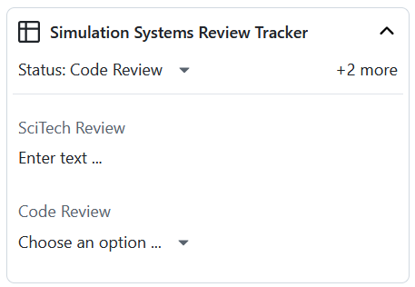
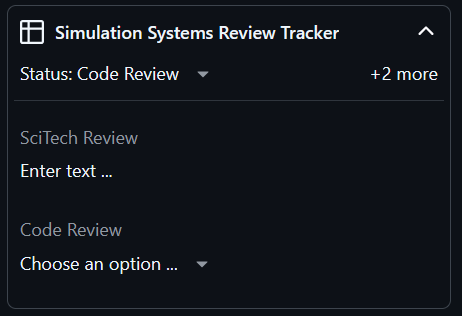

.. _scitech_review:

Science and Technical Review
============================

.. tip::

  GitHub documentation on the review process and interface:
  `Reviewing Proposed Changes in a Pull Request <https://docs.github.com/en/pull
  -requests/collaborating-with-pull-requests/reviewing-changes-in-pull-requests/
  reviewing-proposed-changes-in-a-pull-request>`_

Purpose of the review
---------------------

The purpose of code review is to ensure that the code does the job it says it
performs, is standards compliant and well documented.

Reviewer responsibilities and checkpoints
-----------------------------------------

The pull request template that populates the pull request description box
contains a SciTech Review section with questions to help you think through all
the areas of concern. This SciTech review section should be completed once you are finished.

The Science / Technical reviewer should

* Understand the area of code and check that the changeset satisfies the
  purpose of the change.

* Ensure that the code has no unwanted side-effects

* Ensure that the code is written to the standards laid out in `UMDP3
  <https://code.metoffice.gov.uk/doc/um/latest/papers/umdp_003.pdf>`__ or
  `LFRic Coding Styles
  <https://code.metoffice.gov.uk/trac/lfric/wiki/LFRicTechnical/CodingStandards>`__.

* Make sure that the in-line documentation is accurate and sufficient.

* Ensure that any related :ref:`external documentation <docs>` is updated as
  necessary.

* Check that the pull request has been completed fully and accurately with
  sufficient detail for others to understand the impact of the change.

* Ensure that testing has been carried out satisfactorily (and recorded on the
  pull request), and that there is no impact for configurations outside the
  required scope of the changeset.

Final decision points and actions
---------------------------------

The science/technical reviewer must demand that non-compliance is corrected
before a change is passed onto the next level of review.

The pull request will likely iterate between the reviewer and the developer during
the review process while retaining it's sci/tech review status.

Once you are happy that the change is appropriate and correct, and the code
review parts of the pull request template have been completed then change
the review state to
Code Review and leave an approving review.

