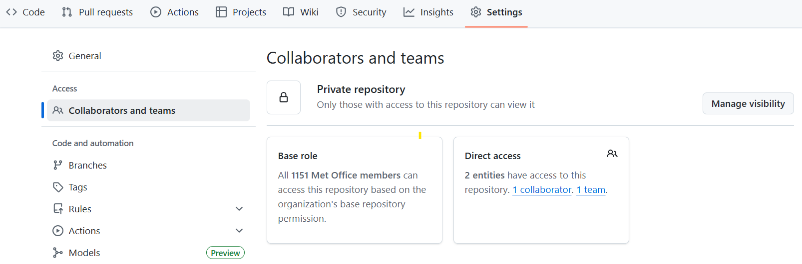
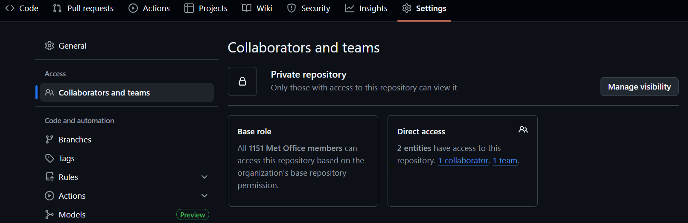
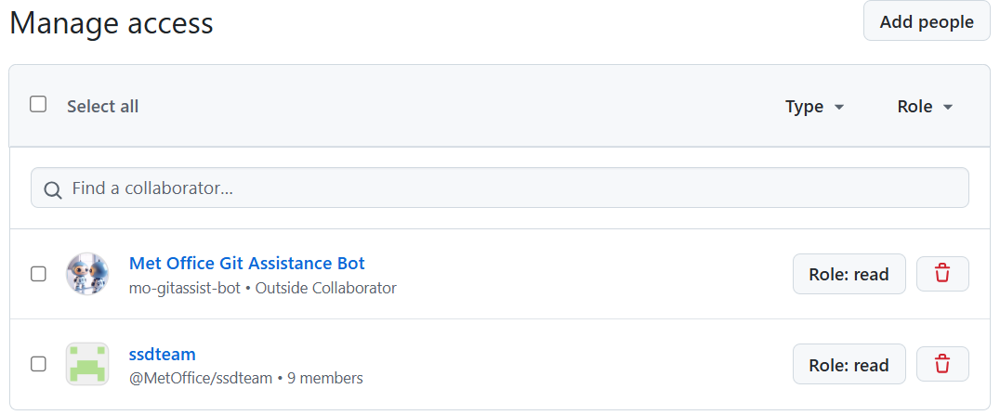
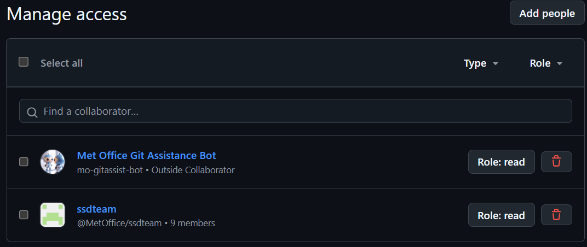

.. _forking:

Creating and Managing Forks
===========================

.. tip::

    For more information see the `github documentation
    <https://docs.github.com/en/pull-requests/collaborating-with-pull-requests/working-with-forks>`__

Forks are repositories that share code and visibility settings with the
upstream repository. They provide a place for development work to take place
while allowing the upstream repo to maintain limited write access. Forks can
all merge branches with each other as well as with the upstream repository,
meaning a pull request can be opened to merge a branch in a fork into the
upstream main.

Creating a Fork
---------------

Creating a fork is something that only needs to be done once per upstream
repository. Once created, branches can be created in the fork as desired by
the owner.

.. tab-set::

    .. tab-item:: Web Browser

        First navigate to the upstream repository you wish to fork. Then select
        the fork button.

        .. image:: images/gh_screenshots/fork_button_light.png
            :class: only-light border

        .. image:: images/gh_screenshots/fork_button_dark.png
            :class: only-dark border

        On the next page you can rename your fork if desired and select which
        branches to fork - ensure this box is unticked to fork all branches.

        .. important::

            Ensure the option to only clone the default branch is unticked.

        .. image:: images/gh_screenshots/fork_page_light.png
            :class: only-light border

        .. image:: images/gh_screenshots/fork_page_dark.png
            :class: only-dark border

    .. tab-item:: gh cli

        Run the following command, substituting for the required upstream owner
        and repository name,

        .. code-block:: shell

            gh repo fork <OWNER>/<REPO>

        .. tip::

            Add ``--clone`` to immediately clone the forked repo

Maintaining a Fork
------------------

Most work to maintain a fork involves syncing it with the upstream repository.
Syncing a fork will ensure that changes to the upstream repository are copied
into the fork. Syncing is done on a per branch basis. For example, after a new
release, syncing the ``stable`` branch will ensure the forks ``stable`` branch
contains the newly released code.

.. important::

    It is recommended that developers do not modify the synced branches from
    upstream in their forks as this may cause issues with merge conflicts when
    syncing a fork. Instead all work should be carried out in a branch.

.. tab-set::

    .. tab-item:: Web Browser

        Navigate to your fork in github that you wish to sync. Select the
        ``Sync Fork`` button and if required, update the branch. This will
        only sync the branch you are currently on - to sync other branches
        select one from the branch dropdown menu. You may want to sync both
        ``stable`` and ``main``, particularly at a release.

        .. image:: images/gh_screenshots/sync_fork_light.png
            :class: only-light border

        .. image:: images/gh_screenshots/sync_fork_dark.png
            :class: only-dark border

        The synced branch will still only exist in the remote repository. If
        you require them in a local clone make sure to ``fetch`` or ``pull``
        the repository.

    .. tab-item:: gh cli

        .. code-block:: shell

            gh repo sync [<owner>/<repo>] [-b <branch>]

        * The command syncs changes from a remote repository to your fork or
          local copy.
        * Both ``<owner>/<repo>`` and ``-b <branch>`` are optional.
        * If ``-b <branch>`` isn't specified, it will sync the default branch
          (main),
        * There is no built-in ``gh repo sync`` option for all branches,
          therefore the user needs to specify a branch name when not syncing the
          not the default branch.
        * If you run this without ``<owner>/<repo>``, it will sync changes from
          the remote origin to your local clone.

          * Doing this will not update your remote fork, this will also require
            a ``git push`` command.

        * By providing your username and fork name to ``<owner>/<repo>``, it
          will sync changes from the upstream parent repository into your remote
          fork.

          * Doing this will not update your local clone, this will also require
            a ``git pull`` command.

    .. tab-item:: git commands

        Ensure that the upstream repository is available as a remote source and
        the latest changes have been fetched. See :ref:`setting git remote
        sources <git_remote>` for more details.

        Then run the following commands for each branch you wish to sync. The
        example below will use ``main``.

        .. code-block:: shell

            # Change to the desired branch
            git switch main

            # Merge in changes from the upstream
            git merge upstream/main

            # Push the changes back to the remote fork
            git push

.. tip::

    Note that the options above will result in the synced branch being available
    in different locations. Using the web browser will not update your
    local clone while using ``git`` commands will not update the remote
    repository without pushing. ``gh`` can be used to update either.

Optional - Adding the MetOffice Mirror Bot
------------------------------------------

The ``mo-gitassist-bot`` is a user which can be granted read access to a
repository, allowing it to mirror the repository to a central location on
MetOffice platforms. This repository can then be cloned using the local mirror,
avoiding the need to authenticate with github. This may be useful, eg. for
shared accounts which do not have a github account themselves. The mirrors are
read only - committing and pushing back to the remote repository will require a
github account.

All simulation systems repositories have this bot added, allowing them to be
cloned from the mirrors by running,

.. code-block:: shell

    git clone /path/to/mirrors/MetOffice/repository.git

Please contact the SSD team or the git migration project for the path to the
mirrors.

If you wish to be able to access a fork from the mirror, then you will need to
add the bot to your forked repository. First, in your fork, navigate to the
``Settings`` tab and the ``Collaborators`` section.

There, use the ``Add People`` button to add the ``mo-gitassist-bot`` with
``Read`` permissions,

To clone a fork from the mirrors requires a slightly different approach to
normally cloning a fork.

.. code-block:: shell

    # Clone the mirror repository as above and move into it
    git clone /path/to/mirrors/MetOffice/repository.git && cd repository

    # Fetch the fork and branch.
    # fork-username is the username of the owner of the desired fork
    # fork-branch is the branch to be checked out
    git fetch origin <fork-username>/<fork-branch>

    # Checkout the forked branch
    git checkout FETCH_HEAD
