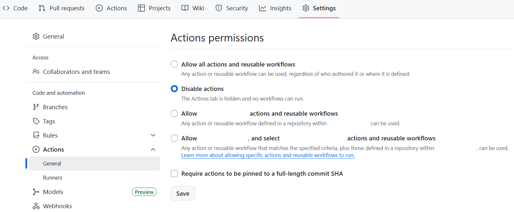
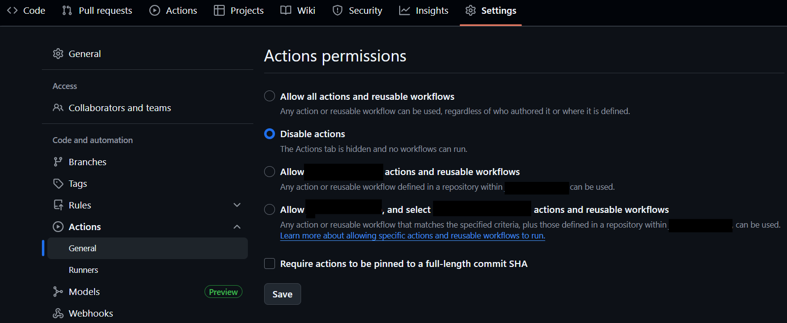

.. -----------------------------------------------------------------------------
    (c) Crown copyright Met Office. All rights reserved.
    The file LICENCE, distributed with this code, contains details of the terms
    under which the code may be used.
   -----------------------------------------------------------------------------

.. _forking:

Creating and Managing Forks
===========================

.. tip::

    For more information see the `GitHub documentation
    <https://docs.github.com/en/pull-requests/collaborating-with-pull-requests/working-with-forks>`__

Forks are repositories that share code and visibility settings with the
upstream repository. They provide a place for development work to take place
while allowing the upstream repo to maintain limited write access. Forks can
all merge branches with each other as well as with the upstream repository,
meaning a pull request can be opened to merge a branch in a fork into the
upstream main.

Creating a Fork
---------------

Creating a fork is something that only needs to be done once per upstream
repository. Once created, branches can be created in the fork as desired by
the owner.

.. tab-set::

    .. tab-item:: Web Browser

        First navigate to the upstream repository you wish to fork. Then select
        the fork button.

        .. image:: images/gh_screenshots/fork_button_light.png
            :class: only-light border

        .. image:: images/gh_screenshots/fork_button_dark.png
            :class: only-dark border

        On the next page you can rename your fork if desired and select which
        branches to fork - ensure this box is unticked to fork all branches.

        .. important::

            Ensure the option to only clone the default branch is unticked.

        .. image:: images/gh_screenshots/fork_page_light.png
            :class: only-light border

        .. image:: images/gh_screenshots/fork_page_dark.png
            :class: only-dark border

    .. tab-item:: gh cli

        Run the following command, substituting for the required upstream owner
        and repository name,

        .. code-block:: shell

            gh repo fork <OWNER>/<REPO>

        .. tip::

            Add ``--clone`` to immediately clone the forked repo

Disable Github Actions in your fork
-----------------------------------

It is a good idea to disable GitHub actions on your fork otherwise you will
regularly get failures when updating your main branch, due to the failure to
deploy documentation. Doing this will not prevent the CI running when you open a
pull request.

To disable, in your fork on GitHub, navigate to Settings and then
Actions/General. There select the option to ``Disable actions`` and save.

Optional - Adding the MetOffice Mirror Bot
------------------------------------------

.. important::

    While this step is optional, the suggested approach for extracting code for
    scientific suites uses these Git Mirrors. If you are likely to use branches
    in these suites, then this step is recommended.

The ``mo-gitassist-bot`` is a user which can be granted read access to a
repository, allowing it to mirror the repository to a central location on
MetOffice platforms. This repository can then be cloned using the local mirror,
avoiding the need to authenticate with GitHub.

This is the recommended approach for extracting code for scientific suites and
may be useful for shared accounts which do not have a GitHub account themselves.
The mirrors are read only - committing and pushing back to the remote repository
will require a GitHub account.

All simulation systems repositories have granted access to this bot, allowing
them to be cloned from the mirrors by running,

.. code-block:: shell

    git clone /path/to/mirrors/MetOffice/repository.git

Please contact the SSD team or the git migration project for the path to the
mirrors.

If you wish to be able to access a fork from the mirror, then you will need to
add the bot to your forked repository. First, in your fork, navigate to the
``Settings`` tab and the ``Collaborators`` section.

.. image:: images/gh_screenshots/collaborators_light.png
    :class: only-light border

.. image:: images/gh_screenshots/collaborators_dark.png
    :class: only-dark border

There, use the ``Add People`` button to add the ``mo-gitassist-bot`` with
``Read`` permissions,

.. image:: images/gh_screenshots/mo_bot_light.png
    :class: only-light border

.. image:: images/gh_screenshots/mo_bot_dark.png
    :class: only-dark border

To clone a fork from the mirrors requires a slightly different approach to
normally cloning a fork.

.. code-block:: shell

    # First clone the mirror of the upstream repository
    git clone /path/to/mirrors/MetOffice/repository.git && cd repository

    # Fetch the fork and branch.
    # fork-username is the username of the owner of the desired fork
    # fork-branch is the branch to be checked out
    git fetch origin <fork-username>/<fork-branch>

    # Checkout the forked branch
    git checkout FETCH_HEAD

To use the mirrors, you will likely need to run the following once, from the
command line:

.. code-block:: shell

    git config --global --add safe.directory "/path/to/mirrors/MetOffice/*"
