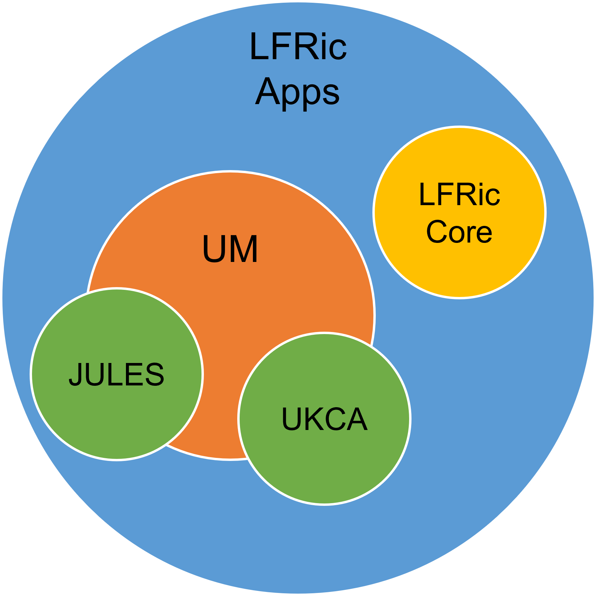

.. _multirepo:

Working with Multiple Repositories
==================================
The repositories covered by these working practices all interact with and have
dependencies on each other. This means that changes that affect multiple
repositories need handling with extra care.

To think about how the repositories work together it's useful to think about
them as almost concentric circles. The child repositories such as JULES or UKCA
sit in the centre and are mostly independent of anything else. The UM
is a parent of those repositories and is dependant on changes in it's own code
base and on those in the children. LFRic Apps is then another layer again and is
dependant on both the UM physics and the other child repositories. LFRic Apps
also utilises the infrastructure in LFRic Core.

This means that changes to the science code in JULES etc will need testing with
both the UM and LFRic Apps to check for any interactions. Likewise, changes to the
atmosphere code in the UM will require LFRic Apps testing.

.. _linked:

Preparing Linked Tickets
------------------------
Every repository in a set of linked changes requires a ticket. Guidance on
setting these up can be found in :ref:`ticket`. These tickets will be treated
as a group with the same reviewers and committed at the same time.

Do:
    * Make sure every ticket has a cross reference to the others in the set, e.g. ``um:#1234``
    * Use :ref:`keywords` to show which other repositories are involved
    * Get the tickets ready for review at the same time
    * Ask for help testing if you don't have access to all the codebases involved

.. important::
    Code branches in linked tickets will require branching from compatible revisions
    to ensure they work together.

    If working with branches from a release then all repositories will  be tagged
    with suitable keywords, e.g. for UM vn13.0, other repositories are also tagged
    with um13.0.

    For head of trunk revisions make sure that all branches/revisions being used
    are at least as recent as the versions listed in the `_rev` parameter of
    `<lfric_apps_trunk>/dependencies.sh`, or `<um_trunk>/rose-stem/rose-suite.conf`.

    If in doubt, please contact the Simulation Systems and Deployment Team for advice.

.. _multirepo_testing:

Multi-Repo Testing
------------------

Please see :ref:`this page <multi-repo_testing>` for details on how to test multiple repositories together.
