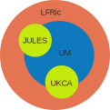

.. _multirepo:

Working with Multiple Repositories
==================================
The repositories covered by these working practices all interact with and have
dependencies on each other. This means that changes that affect multiple
repositories need handling with extra care.

To think about how the repositories work together it's useful to think about
them as almost concentric circles. The child repositories such as JULES or UKCA
sit in the centre and are mostly independent of anything else. The UM
is a parent of those repositories and is dependant on changes in it's own code
base and on those in the children. LFRic is then another layer again and is
dependant on both the UM physics and the other child repositories.

This means that changes to the science code in JULES etc will need testing with
both the UM and LFRic to check for any interactions. Likewise, changes to the
atmosphere code in the UM will require LFRic testing.

.. _linked:

Preparing Linked Tickets
------------------------
Every repository in a set of linked changes requires a ticket. Guidance on
setting these up can be found in :ref:`ticket`. These tickets will be treated
as a group with the same reviewers and committed at the same time.

Do:
    * Make sure every ticket has a cross reference to the others in the set, e.g. ``um:#1234``
    * Use keywords to show which other repositories are involved
    * Get the tickets ready for review at the same time
    * Ask for help testing if you don't have access to all the codebases involved

.. important::
    Code branches in linked tickets will require branching from compatible revisions
    to ensure they work together.

    If working with branches from a release then all repositories will  be tagged
    with suitable keywords, e.g. for UM vn13.0, other repositories are also tagged
    with um13.0.

    For head of trunk revisions make sure that all branches/revisions being used
    are at least as recent as the versions listed in the `_rev` parameter of
    `<lfric_trunk>/lfric_atm/fcm-make/parameters.sh`, or `<um_trunk>/rose-stem/rose-suite.conf`.

    If in doubt, please contact the Simulation Systems and Deployment Team for advice.

Testing Changes Together
------------------------
Multi-repository changes are expected to pass the regression tests for all the
repositories involved. To carry out the tests involved in a linked ticket it can
be helpful to refer to the semi-concentric circles above; layering the testing
from the inside out as needed. Further details of how testing in each
repository is handled can be found :ref:`here <testing>`. Compatible
code revisions are needed for testing across repositories as described above.

Testing changes in JULES, UKCA, or any other child repositories is
as simple as running the standalone test procedures for these codebases.

Testing the UM with other repositories
^^^^^^^^^^^^^^^^^^^^^^^^^^^^^^^^^^^^^^

To test the UM, any changes to JULES, UKCA, Socrates, CASIM etc will also need
to be included. This is done by adding another source to the rose stem command
line.

    1. :ref:`Checkout<checkout>` a UM working copy

        - this may be your branch from a linked ticket, or a clean trunk copy
          at either the last release or a suitable head of trunk revision.

    2. Run rose stem, including groups that cover the repositories being tested
       and a source code path to every branch involved.

        .. code-block::

            rose stem --group=developer,jules,ukca --source=. --source=/path/to/jules/changes --source=/path/to/ukca/changes

The source paths involved can either be to local working copies or links to the
fcm source control e.g. ``fcm:jules.xm_br/dev/user/branch_name``. As many source
paths as needed can be added to the list.

Testing LFRic with other repositories
^^^^^^^^^^^^^^^^^^^^^^^^^^^^^^^^^^^^^

LFRic testing needs to encompass all of the other repositories affected. Paths
to the other codebases involved should be added to
``lfric_atm/fcm-make/parameters.sh`` under each of the ``*_sources`` variables. Again
these paths can either be to local changes or those in the repository.

    1. :ref:`Checkout<checkout>` an LFRic working copy

        - this may be your branch from a linked ticket, or a clean trunk copy
          at either the last release or a suitable head of trunk revision.

    2. Update parameters.sh to point to all other code changes

        .. code-block:: RST

            um_sources=vldXXX:/path/to/um/working/copy
            jules_source=vldXXX:/path/to/jules/working/copy

    3. Run test-suite

        .. code-block::

            `make test-suite`

.. tip::
    Links to changes stored in fcm source control should point at the mirror
    repository (note `jules.xm` rather than `jules.x` above). Links to local
    changes provided to the LFRic build should start with `<hostname>:`.

.. note::
    If any of the testing shows up failures then there are two possible ways to
    proceed:

    1. The changes made should be re-written to avoid breaking the dependant
       repositories

    2. The changes made directly affect the interface between repositories and
       therefore a change is also needed to the parent repository to adapt to that change.

    If you're uncertain which route to take then the Code Owners involved will
    hopefully be able to advise.
