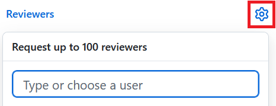
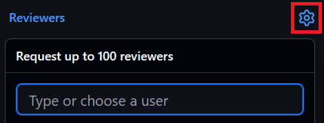

.. _pull_requests:

Pull Requests
=============

Once you are happy with your development and the :ref:`test suites <testing>`
pass then you are ready to pass your ticket to review. Reviews in github are
done through pull requests.

Changes will usually go through a 2-stage review process:

1. SciTech review; carried out by someone that understands the area of code being
   developed
2. Code review; carried out by a member of the Simulation Systems Review Team

Trivial pull requests are an exception and do not require a SciTech review.

:ref:`Linked pull requests <linked>` will move through the review states together.

.. tip::

  Some things to consider when getting ready for review:

  * If your development changes answers then make sure you have followed the
    steps on :ref:`preparing a KGO ticket for review.<kgo>`

  * Get in touch with your SciTech Reviewer before you feel ready for review.
    They will have valuable insights into the code and, particularly for larger
    changes, may appreciate the opportunity to look at your work as it
    progresses.

  * The review process will iterate between the developer and each reviewer
    until the changes made are agreed to be of sufficient quality. This aims to
    improve the quality of your change, considering a range of scientific and
    technical aspects.The reviewer will fill in their section of the pull
    request template which makes sure all aspects of the ticket are considered.

  * Review suggestions and comments are formed into conversations. The `Resolve
    Conversation` button is used by the reviewer when they are satisfied to
    close that part of the review. The developer should not resolve
    conversations themselves.

Opening a Pull Request
----------------------

The first step to the begin the review process in github is to open a pull
request. A pull request shows the proposed changes to the target branch and
provides a space for reviews and discussion to take place. There a number of
ways of opening a pull request. If your branch has had recent changes, then a
box may appear in the either of the Upstream or Fork github pages, with a
button to ``Compare & pull request``.

Alternatively, navigate to the github page of your fork and select the
``Contribute`` button,

.. image:: images/gh_screenshots/contribute_light.png
    :class: only-light border

.. image:: images/gh_screenshots/contribute_dark.png
    :class: only-dark border

The resulting page will allow you to create a pull request. The first thing to
check are the target and source branches for the pull requests.

.. image:: images/gh_screenshots/branch_pr_light.png
    :class: only-light border

.. image:: images/gh_screenshots/branch_pr_dark.png
    :class: only-dark border

You have 4 options to consider.

* ``base repository`` - This is the repository where the pull request will be
  merged into. It will be the upstream repository you forked from.
* ``base`` - This is the branch in the ``base repository`` where the pull
  request will be merged into. It will default to the repositories default
  branch which for Simulation Systems repositories will be ``main`` which is
  as desired.
* ``head repository`` - This is the repository where the pull request changes
  are coming from - it will be your forked repository.
* ``compare`` - This is the branch in the ``head repository`` containing
  proposed changes. It will be the branch you switched to above, but this can
  be changed now. It is **not** possible to edit this once the pull request
  has been opened, so make sure it is correct now.

.. important::

    Make sure the base and compare branches are correct.

Fill out the rest of the pull request by giving an appropriate title and
supplying a description:

* The title will be used as the commit message and should be therefore be short
  and succinct. It should not contain any issue or pull request numbers.

* The description box will contain a pull request template to fill out
  including details of your change, any approvals needed, documentation
  required and testing performed.

Ensure that the option to allow edits by maintainers box
is selected (see :ref:`reviewer_edits` for details).

.. image:: images/gh_screenshots/maintainer_edit_light.png
    :class: only-light border

.. image:: images/gh_screenshots/maintainer_edit_dark.png
    :class: only-dark border

.. important::

    If an issue exists for the work being completed then you should `link your
    pull request with that issue. <https://docs.github.com/en/issues/
    tracking-your-work-with-issues/using-issues/
    linking-a-pull-request-to-an-issue>`_

Once you are happy with the pull request details open the pull request.
Initially you can choose to do this in draft mode, to allow you time to do any
final fixes based on continuous integration. **If you use draft mode mark the
pull request as ``ready for review`` once you are satisfied.**

Continuous Integration
----------------------

Once the pull request has been opened, any changes to either it or the source
branch will trigger continuous integration (CI). CI is a way of running tests
on the changes proposed by the pull request. Due to resource constraints,
these tests are constrained in their size and usually target items such as
code styling.

.. important::

    CI tests will not run any atmosphere or integration models of simulation
    system code as these are too computationally expensive. These tests are
    run as part of the :ref:`rose-stem suites <testing>`. Some of the tests
    run by the continuous integration are also run as part of the rose-stem
    suites.

Continuous Integration is reported on towards the bottom of the pull request
conversation. In the example below, all CI tests have passed. If you encounter
failures, then you can click on the failing job to find the log messages.
Certain CI tests are required to pass in order for the branch to be mergeable,
for example the ``WIP`` test below which is marked with a ``required`` label.
Even if CI tests are not marked as required, the pull request will likely be
rejected with failing tests.

.. image:: images/gh_screenshots/ci_light.png
    :class: only-light border

.. image:: images/gh_screenshots/ci_dark.png
    :class: only-dark border

.. _updating_branch:

Updating a branch
-----------------

Most development work in simulation-systems repositories will take place on a
branch created from ``stable``. Therefore it will need to be updated to match
the latest changes from ``main`` when a pull request is open. Github provides
functionality to do this in the browser, with the ability to fix merge
conflicts. Alternatively, you can do this from a terminal using git.

.. important::

    In order to aid the development of scientific suites, the majority of
    development should be done on a branch from ``stable`` without merging in
    changes from ``main``. Only when the development has been completed and
    the pull request is almost ready for commit should you merge in ``main``.

.. tab-set::

    .. tab-item:: Web Browser

        Navigate to the pull request page and locate the branch status box.
        This is towards the bottom of the conversation. Here, you can select
        the button to update the branch. If merge conflicts exist, it will
        take you to a page where these can be fixed.

        .. image:: images/gh_screenshots/update_branch_light.png
            :class: only-light border

        .. image:: images/gh_screenshots/update_branch_dark.png
            :class: only-dark border

    .. tab-item:: git commands

        Navigate to your clone and ensure that the branch you wish to update is
        your active branch,

        .. code-block:: shell

            cd /path/to/clone
            git switch <desired-branch>

        Ensure that the upstream repository is available as a remote source.
        See :ref:`setting git remote sources <git_remote>` for more details.

        Then fetch and merge in the upstream main,

        .. code-block:: shell

            git fetch upstream
            git merge upstream/main

        If there are any merge conflicts you can now fix these using your
        conflict tool of choice.

Selecting Reviewers
-------------------

SciTech Review
^^^^^^^^^^^^^^
The SciTech review is done by someone who is familiar with the area being
changed to check that the change does what is says, in a sensible way, and
doesn't do what it shouldn't. First refusal for completing the SciTech review
should go to the main code owner(s) for the area affected. If they don't want to
then they may have suggestions for other suitable reviewers or you can approach
anyone who would have good insight into the changes made.

Changes that have a linked LFRic Core ticket should find a SciTech reviewer from
the CCD Team.

Once you have found a reviewer, request their review by clicking the cog
next to the `Reviewers` pane on the right of the pull request and selecting
their name or github user ID.

Guidance for the SciTech reviewer can be found on the
:ref:`SciTech review page <scitech_review>`.

Code Review
^^^^^^^^^^^
Code reviewers are assigned by the Simulation Systems and Deployment Team from
a pool of repository maintainers. New ``ready for review`` pull requests will be
assigned a reviewer on a daily basis. If you need your pull request looking at
more urgently than that, or think your pull request has been overlooked, then
leave a comment for ``@ssdteam`` on the pull request.

The code reviewer will be listed as both a reviewer and assignee. This is to
help us track who is responsible for overseeing the final review signoff and
merge.

Guidance for the Code reviewer can be found on the
:ref:`Code review page <code_review>`.

.. _reviewer_edits:

Code Reviewer Edits
^^^^^^^^^^^^^^^^^^^

As part of the process to commit certain tickets, code reviewers will sometimes
need to commit changes to the branch of a developer. Common reasons for doing
this include,

* Updating KGO's
* Applying upgrade macros
* Updating commit hashes for linked tickets

The ability to commit back to another users fork is only available to those with
``maintainer`` access or above and they can only do so for branches with an open
pull request and the ``Allow edits by maintainers`` option selected.

Tracking Review Status
----------------------

All open pull requests will be added to a GitHub Project called
``Review Tracker``. This is used to give pull requests a status that
distinguishes between the different review states. Some states are achieved
automatically, some require changing manually:

* When the developer feels a PR is ready for the SciTech or Code Reviewer to
  look at the state should be **manually** changed to ``SciTech Review`` or
  ``Code Review`` as appropriate.

* When the SciTech Review has been completed the state should be **manually**
  changed to Code Review.

.. image:: images/gh_screenshots/project_scitech_light.png
    :class: only-light border

.. image:: images/gh_screenshots/project_scitech_dark.png
    :class: only-dark border

Automatic changes include:

* When changes are requested by a reviewer the state becomes ``Changes Requested``
* When the pull request has been approved the state becomes ``Approved``
* When the pull request has been merged, or otherwise closed, the state becomes
  ``Done``

