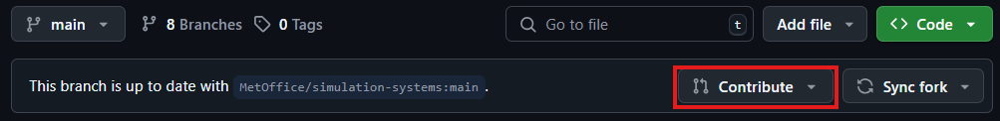
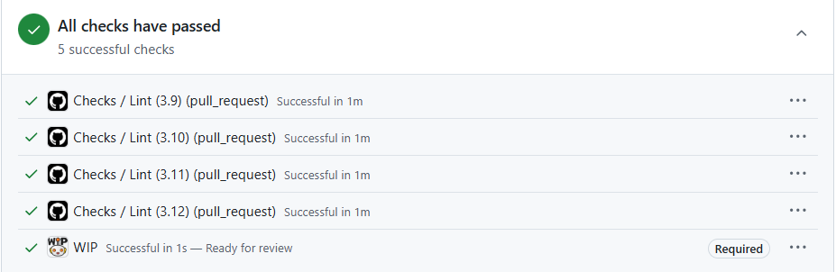

.. _ready_for_review:

Ready for Review
================

.. toctree::
    :maxdepth: 1
    :hidden:
    :caption: Reviews

    approvals
    reviews

Once you are happy with your development and the :ref:`test suites <testing>` pass then you are ready to pass your ticket to review. Tickets usually have 2 levels of review, with the process and advice available on the :ref:`reviews page <reviews>`. You will also require the :ref:`approvals` from any relevant Code Owners.

Opening a Pull Request
----------------------

The first step to the begin the review process in github is to open a pull request. A pull request shows the proposed changes to the target branch and provides a space for reviews and discussion to take place. There a number of ways of opening a pull request. If your branch has had recent changes, then a box may appear in the either of the Upstream or Fork github pages, with a button to ``Compare & pull request``.

Alternatively, navigate to the github page of your fork and select the ``Contribute`` button,

.. image:: images/gh_screenshots/contribute_light.png
    :class: only-light border

The resulting page will allow you to create a pull request. The first thing to check are the target and source branches for the pull requests.

.. image:: images/gh_screenshots/branch_pr_light.png
    :class: only-light border

.. image:: images/gh_screenshots/branch_pr_dark.png
    :class: only-dark border

You have 4 options to consider.

* ``base repository`` - This is the repository where the pull request will be merged into. It is almost certainly the upstream repository you forked from.
* ``base`` - This is the branch in the ``base repository`` where the pull request will be merged into. It will default to the repositories default branch. However, most pull requests to simulation systems repositories will be targetting ``main``, so make sure to change that here (it can be done later if forgotten).
* ``head repository`` - This is the repository where the pull request changes are coming from. It is almost certainly your fork.
* ``compare`` - This is the branch in the ``head repository`` containing proposed changes. It will be the branch you switched to above, but this can be changed now. It is **not** possible to edit this once the pull request has been opened, so make sure it is correct now.

.. important::

    Make sure the base and compare branches are correct.

Fill out the rest of the pull request by giving an appropriate title and supplying a description. The description box will contain a pull request template to fill out. Ensure that the option to allow edits by maintainers box is selected (see :ref:`reviewer_edits` for details).

.. image:: images/gh_screenshots/maintainer_edit_light.png
    :class: only-light border

.. image:: images/gh_screenshots/maintainer_edit_dark.png
    :class: only-dark border

.. tip::

    It is possible to `link your pull request with an issue <https://docs.github.com/en/issues/tracking-your-work-with-issues/using-issues/linking-a-pull-request-to-an-issue>`_

Once you are happy with the pull request details open the pull request. Initially you should do this in draft mode, to allow you time to do any final fixes based on continuous integration.

Continuous Integration
----------------------

Once the pull request has been opened, any changes to either it or the source branch will trigger continuous integration (CI). CI is a way of running tests on the changes proposed by the pull request. Due to resource constraints, these tests are constrained in their size and usually target items such as code styling.

.. important::

    CI tests will not run any atmosphere or integration models of simulation system code as these are too computationally expensive. These tests are run as part of the :ref:`rose-stem suites <testing>`. Most of the tests run by the continuous integration are also run as part of the rose-stem suites.

Continuous Integration is reported on towards the bottom of the pull request conversation. In the example below, all CI tests have passed. If you encounter failures, then you can click on the failing job to find the log messages. Certain CI tests are required to pass in order for the branch to be mergeable, for example the ``WIP`` test below which is marked with a ``required`` label. Even if CI tests are not marked as required, the pull request will likely be rejected with failing tests.

.. image:: images/gh_screenshots/ci_dark.png
    :class: only-dark border

.. _reviewer_edits:

Code Reviewer Edits
^^^^^^^^^^^^^^^^^^^

As part of the process to commit certain tickets, code reviewers will sometimes need to commit changes to the branch of a developer. Common reasons for doing this include,

* Updating kgo's
* Applying upgrade macros
* Updating commit hashes for linked tickets

The ability to commit back to another users fork is only available to those with ``maintainer`` access or above and they can only do so for branches with an open pull request and the ``Allow edits by maintainers`` option selected.

