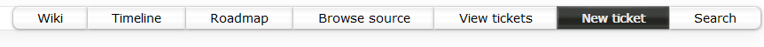

.. _ticket:

Create a Ticket
===============
Every change requires an associated ticket. This helps the developer
organise and document their work and the reviewers to perform and
document their tasks. It also provides a permanent record to refer
back to.

#. Log in to the Science Repository Service with your username and password.
#. Navigate to the project you wish to create a ticket in.
#. Click the ``New ticket`` button in the ribbon which appears at the top right of the Trac webpage.

The ticket information can then be filled in. A description of each item in the ticket is as follows:

Summary
-------

This should be a single-line, top-level summary of your change. Do not make
it too generic (e.g. ``fix bug``) as this doesn't help identify your ticket
from potentially thousands in the Trac system. Try and use something more
descriptive (e.g. ``Fix out-of-bounds issue in subroutine radar_wavelength``).

Description
-----------

This box allows for a more verbose description of what the issue is and
supporting information. The description box can be modified during the
development process to include additional information about the change.

.. tip::
  If your ticket follows-on from an earlier development, you can mention
  this in the description by linking the ticket e.g.
  ``Further changes following #1234``.

  Tickets in other repositories can also be linked by including their
  repository name and a colon before the ticket number, e.g. ``um:#1``,
  ``lfric:#23``,

Type
----

Most repositories have a set of standard types, e.g.:

 * Defect (e.g. bug fix or issue)
 * Enhancement (e.g. new scientific functionality)
 * Optimisation (to use less resources)
 * Task (for any other code change; e.g. delete unused code).

You should choose whichever type is most appropriate to your code change.

**LFRic Core** has a number of different types. Either choose the most appropriate
based on your change or seek guidance from a member of the Core Capability Development
team or an experienced LFRic developer.

Milestone
---------

This is used to indicate the release or version of the model your change will
be included at. These vary between projects, but it's common to choose either
a milestone for the next release, or a milestone without a deadline date.

.. tip::
  Most projects also have a ``hopefully`` or ``somewhen`` milestone for changes
  which don't yet have a milestone assigned. If you are developing
  a change, it's a good idea to set the milestone to this while
  doing the early development and especially if you are unsure as to which
  release cycle your change will make. This prevents you from being chased
  by the SSD team when the release deadline draws near.

All tickets for a particular milestone are visible either from the Roadmap
feature in Trac or via a custom query in View Tickets.

Cc
--

**Optional:** Enter the usernames of others who wish to receive email
updates with the ticket status (e.g. co-developers). If in doubt, it's
best to leave this box blank.

.. tip::
  Use the cc box sparingly as the Trac system does generate an email
  every time the ticket is updated. Trac will also send an email to
  **anyone** who has edited a ticket.

  Therefore if someone includes your name in the cc box, editing
  the ticket yourself to take your name out of the cc list will mean
  you get the same amount of email from Trac as you have 'touched' the
  ticket.

Priority (LFRic Core/JULES/UKCA/CASIM)
--------------------------------------

This is a list of options to show how important that the change is
committed to your project, including:

* blocker (LFRic only)
* critical
* major
* normal (not used in LFRic)
* minor
* trivial

Again, the developer should choose whichever they feel is the most
appropriate setting.

.. tip::
  It's best to use the higher priority categories sparingly and with
  prior consultation (e.g. for an urgent bug fix). If in doubt, just
  select ``normal`` or ``minor``.

Severity (UM/LFRic Apps/SOCRATES)
---------------------------------

The UM, LFRic Apps and SOCRATES have a ticket severity menu instead of a priority
menu. These are as follows:

* **Wholesale**: A code change which alters a huge number of files. Use only with prior consultation of the SSD team.
* **Significant**: Any code change which touches more than one repository, updates KGO or changes both source code and metadata.
* **Minor**: A change which touches source code *or* metadata, **but not both**.
* **Trivial**: A small change of only a couple of lines of code.

.. note::
  Trivial tickets do not need a SciTech review; they should be simple
  and small enough that a CodeSys reviewer can easily understand them without
  any major scientific or technical changes.

Keywords
--------

**Optional:** Keywords are generally used to identify specific aspects
for certain tickets and for managing the way tickets are added to a
project's trunk.

A list of :ref:`keywords` is available.

.. toctree::
    :hidden:

    common_keywords

.. tip::
  Usually there's no particular need to add keywords which are synonyms
  for items in the title or description. However, project keywords may
  be useful for some people.

  If in doubt, it's best to leave the keywords box blank initially, as
  keywords can always be added at a later date.

Component (all repositories except LFRic Apps, JULES and UKCA)
--------------------------------------------------------------

Components vary significantly between different modelling systems. Please
review the list of options and select the one most appropriate to your change,
seeking advice from an experienced developer if you are unsure.

For the UM, selecting ``general`` is probably the best option if your change does
not fit into any of the existing categories.

Owner
-----
Set yourself to be the owner of the ticket. Alternatively, with prior
agreement, you can set it to be any user of the SRS.

.. warning::
  Do not leave the Owner box as ``<default>``. This will often result in
  your ticket becoming lost in the system! It's always best to assign it
  to yourself, even if you know that someone else will eventually make
  the change.

Associated With (LFRic Core only)
---------------------------------
This box is used to link branches and wiki page templates as the ticket is
developed. It is safe to leave it blank when first creating the ticket.

Blocked by (LFRic Core only)
----------------------------
This box can be used to list other tickets which block this change. This
allows the SSD team to prioritise the commit order of the tickets on to
the trunk. Non-LFric Core tickets can specify `blocks` and `blockedby` in the
keywords box.
