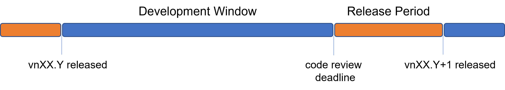
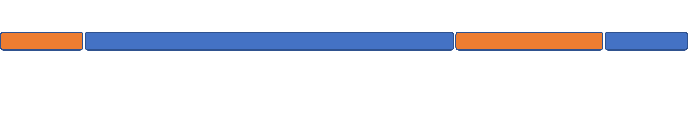

.. _working_practices_index:

Working Practices
=================

The Working Practices (WPs) are a developers guide and are to be followed for
all UM, LFRic Applications, JULES, and UKCA developments (though reference is
also made to LFRic Core, CASIM, SOCRATES and Shumlib where relevant).

If this is your first development we highly recommend following these pages
through in sequence.

Suggestions for changes to these WPs are always gratefully received, though
note that we get regular feedback that the WPs are both too long and too
short. What may be overwhelming detail for one person may be insufficient
detail for another.

.. note::

    Details of recent changes to these practices can be found :ref:`here
    <changes>`

Development Cycle Overview
--------------------------

The general features of the development cycle are similar to those found in
other scientific software. However, the details are tuned to meet the needs of
the community as a whole. A key feature is the use of versions as a way of
periodically bringing everything together.

The release cycle follows a semi-regular cadence, balancing flexibility to
facilitate high priority goals against stability for the broader developer
pool. Each release will consist of a development window spanning from release
of the previous version to a pre-announced code review deadline. Following
this, submissions will be processed culminating in the next release. From time
to time, some or all parts of a repository may be subject to an agreed closed
release to facilitate an intense or disruptive development.

The release cycle is overseen by the Simulation Systems and Deployment Team
with the oversight and support of the Simulation Systems Governance Group, who
impartially consider the needs of all developers and users.

Git/Github Definitions
----------------------

Some commonly used git/github definitions. Further definitions can be found in
the `GitHub Glossary
<https://docs.github.com/en/get-started/learning-about-github/github-glossary>`__.

Clone
  A local copy of either the upstream or the forked repository.

Continuous Integration
  Testing that is run on github based on the changes in a pull request. For
  simulation-sytems repositories, this is run in addition to local rose-stem
  testing. It is commonly referred to as CI.

Fork
  A copy of the upstream repository, owned by the developer. This is where
  development branches are created and worked on. (May also be referred to
  as the downstream repository).

Issue
  An issue is a location to record tasks, problems, questions etc. in a
  repository. They contain their own discussion thread and can be used as a way
  of tracking work and recording details that might not be appropriate in a pull
  request.

Origin
  The default name for the remote source of a cloned repository.

Pull Request
  These represent proposed changes to a repository, submitted by a developer.
  They will undergo a review process before being merged onto the repository if
  accepted. They are often referred to as PRs.

Remote
  The version of either the upstream or the forked repository that is hosted
  by Github.

Upstream
  The primary or parent repository, owned by the MetOffice github
  organisation. Only code reviewers are able to directly interact with this
  repository, rather than being required to use forks.

Development Process
-------------------

The process of developing a change for each repository is described through
these Working Practices. A flowchart of this process for the UM is included
below, but the process is very comparable to that of the other repositories
too.

Simulation Systems github repositories are setup with at least 2 protected
branches, ``main`` and ``stable`` (with the potential for additional version
branches to be added).

* ``main`` - This is the default github branch and is the branch that new
  development pull requests should target. It will never be behind ``stable``
  branch, but will regularly be ahead.
* ``stable`` - This branch represents the codebase at a version release and
  will generally remain unchanged throughout a release cycle. New branches
  should be made from this branch (or from a release tag.) Only new releases
  and small hotfixes to a release will be merged back into this branch.

All general development for Simulation Systems Github repositories will take
place on forks of that repository. It is the responsibility of the developer
to maintain their own fork. See :ref:`forking` for advice on forking.

The development cycle can be seen below.

.. graphviz::

  digraph {
    create_issue -> create_branch -> development -> create_pr;
    create_issue [label="Create an Issue", style=filled, color="#f8b8d0"]
    create_branch [label="Create a Development Branch", style=filled, color="#b9e192"]
    development [label="Develop Changes on Branch", style=filled, color="#b9e192"]
    create_pr [label="Create a PR for the change", style=filled, color="#f8b8d0"]

    create_pr -> test_change;
    test_change [label="Test Changes\nRose Stem locally + CI in PR"]

    test_change -> scitech -> code_review -> commit_ticket;
    scitech [label="SciTech Review", style=filled, color="#f8b8d0"]
    code_review[label="Code Review", style=filled, color="#f8b8d0"]
    commit_ticket[label="Commit branch to main", style=filled, color="#f8b8d0"]

    merge_main -> test_change [style="dashed", label="As Required"];
    merge_main [label="Merge in upstream/main", style=filled, color="#b9e192"]

    test_change -> code_review [dir=back, style="dashed", label="Changes\nRequired", color="#b9e192"];

    subgraph cluster0 {
      upstream -> fork [style=invis];
      upstream [label="Takes place in the\nupstream repository", style=filled, color="#f8b8d0", shape=box]
      fork [label="Takes place in the\nforked repository", style=filled, color="#b9e192", shape=box]
    }
  }

#. :ref:`Create an Issue <create_issue>` in the upstream repository to document
   your changes.
#. :ref:`Create a branch <create_branch>` in your fork of the repo. The branch
   should usually be created from the stable branch.
#. Develop your change on your new branch. See the :ref:`development guide
   <development_index>` for advice on how to do this, including running testing.
#. When ready for review :ref:`create a pull request <pull_requests>` in the
   upstream repository.

  * Ensure that your change is passing the :ref:`Continuous Integration <CI>`
    and you have included proof of local testing.

#. Pass the pull request for review. Usually this will involve first a
   :ref:`Sci Tech review <scitech_review>` and then a :ref:`Code review
   <code_review>`. If any changes are required ensure the testing still passes.

   * Once in code review, you will likely need to update your branch to the
     :ref:`head of main <merge_main>`. This may involve solving merge conflicts.

#. Once the pull request has been approved, the code reviewer will commit it to
   the trunk.

For detailed explanation of these steps, see the subsequent pages, particularly
on :ref:`gh_dev_init`, :ref:`maintaining_forks` and :ref:`pull_requests`.

Before You Start
----------------

.. note::

    In the following Working Practices, we will endeavour to provide options
    for using the Github Web Interface and the ``gh`` cli where possible.
    Further information will be available in the github documentation.

    To get started with the ``gh`` cli, see the `gh quickstart guide
    <https://docs.github.com/en/github-cli/github-cli/quickstart>`__

All developments should be planned using a risk-based approach. Before
starting, consider the complexity and impact of what you want to do. This will
act as a guide for the level of planning and consultation required. There is
no definitive process for this and developers should use their experience and
judgement.

As you begin, there are various people you might consider consulting:

* Relevant :ref:`Code and Configuration Owners <approvals>`
* Simulation Systems and Deployment Team
* Core Capability Development Team
* Tools and Collaborative Development Team
* Less experienced developers may benefit from a 'buddy'

For larger changes, consider splitting the work over multiple Issues and Pull
Requests:

* An overarching issue that sets out the overall picture and tracks the
  progress of the work is encouraged. All sub-issues and pull requests should
  link back to it.
* Each pull request should contain a single coherent change.

  * Pull requests may build on each other, however each should produce a valid
    branch, as detemined by the test suite.
  * The new feature being developed doesn't need to fully work after each pull
    request, but the plan for developing it should be documented on the
    overarching issue.

Consider the timing of your work:

* Be aware of others doing work in similar areas
* Be aware of code review deadlines
* Be aware of closed releases or planned outages
* Allow contingency time when agreeing broader project deadlines. Trunk
  integrity will not be compromised to meet your deadlines.

Consider bringing planning together using an overarching ticket. It can be very
helpful for documenting and monitoring progress of your work.

.. tip::

    Early planning and consultation is strongly recommended to prevent
    disappointment later. More detailed guidance is provided on the
    :ref:`planning` page.

.. toctree::
    :maxdepth: 1
    :hidden:
    :caption: Working Practices

    gh_authorisation
    forking
    gh_dev_init
    maintaining_forks
    multi_repository
    approvals
    pull_requests
    final_steps
    branch_migration
