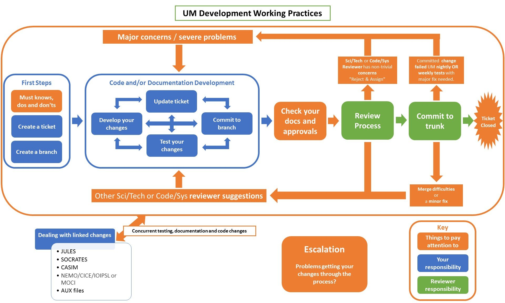

.. _working_practices_index:

Working Practices
=================

The Working Practices (WPs) are a developers guide and are to be followed for
all UM, LFRic Applications, JULES, and UKCA developments (though reference is
also made to LFRic Core, CASIM, SOCRATES and Shumlib where relevant).

If this is your first development we highly recommend following these pages
through in sequence.

Suggestions for changes to these WPs are always gratefully received, though
note that we get regular feedback that the WPs are both too long and too short.
What may be overwhelming detail for one person may be insufficient detail for
another.

.. note::

    Details of recent changes to these practices can be found :ref:`here <changes>`

Development Cycle Overview
--------------------------
The general features of the development cycle are similar to those found in
other scientific software. However, the details are tuned to meet the needs of
the community as a whole. A key feature is the use of versions as a way of
periodically bringing everything together. Although many elements of Continuous
Integration and related approaches to software management can be found, the
nature of LFRic and UM development makes following these impractical.

The release cycle follows a semi-regular cadence, balancing flexibility to
facilitate high priority goals against stability for the broader developer pool.
Each release will consist of a development window spanning from release of the
previous version to a pre-announced code review deadline. Following this,
submissions will be processed culminating in the release of the next release.
From time to time, some or all parts of a repository may be subject to an agreed
closed release to facilitate an intense or disruptive development.

.. image:: images/development_cycle.png
    :class: only-light

.. image:: images/development_cycle_dark.png
    :class: only-dark

The release cycle is overseen by the Simulation Systems and Deployment Team with
the oversight and support of the Simulation Systems Governance Group, who
impartially consider the needs of all developers and users.

..
    .. note::
    LFRic doesn't follow the same release process as the other repositories,
    with continuous testing such that all versions of the LFRic trunk should be
    valid releases. Periodic milestones are used to help with scheduling of work.

Development Process
-------------------
The process of developing a change for each repository is described through these
Working Practices. A flowchart of this process for the UM is included below, but
the process is very comparable to that of the other repositories too.

Before You Start
----------------
All developments should be planned using a risk-based approach. Before starting,
consider the complexity and impact of what you want to do. This will act as a
guide for the level of planning and consultation required. There is no
definitive process for this and developers should use their experience and
judgement.

As you begin, there are various people you might consider consulting:

* Relevant :ref:`Code and Configuration Owners <approvals>`
* Simulation Systems and Deployment Team
* Core Capability Development Team
* Less experienced developers may benefit from a 'buddy'

For larger changes, consider splitting the work over multiple tickets:

* Tickets laying foundations for later are OK
* Tickets should make sense on their own, with a clear scope, to allow for separate testing, review and commit
* Tickets should not be too small or too large
* Beware of the 'also trap'- the 'also' bits can swamp the main aim of your change!
* An overarching ticket that sets out the overall picture and tracks the progress of the work is recommended and all sub-tickets should link back to it

Consider the timing of your work:

* Be aware of others doing work in similar areas
* Be aware of code review deadlines
* Be aware of closed releases or planned outages
* Allow contingency time when agreeing broader project deadlines. Trunk integrity will not be compromised to meet your deadlines.

Consider bringing planning together using an overarching ticket. It can be very
helpful for documenting and monitoring progress of your work.

.. tip::

    Early planning and consultation is strongly recommended to prevent
    disappointment later. More detailed guidance is provided on the
    :ref:`planning` page.

.. toctree::
    :maxdepth: 1
    :hidden:
    :caption: Working Practices

    git_dev_flow
    tickets
    branches
    multi_repository
    approvals
    reviews
    final_steps